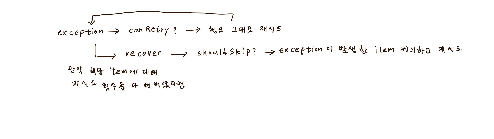

# Retry

## Retry란?

* 데이터 처리 중 예외가 발생했을 때, 해당 데이터에 대한 처리를 다시 시도하는 기능이다.
* ItemProcessor, ItemWriter에서 발생한 예외를 처리할 수 있다. (ItemReader에서 발생한 예외에는 적용되지 않는다)
* 예외가 발생했을 때 Chunk의 처음으로 돌아가 Reader로부터 아이템을 다시 읽어들여 재시도한다. 이때, skip과는 다르게 예외가 발생한 아이템도 포함하여 데이터를 읽어온다.
* 지정한 retry 횟수 이상으로 예외가 발생했을 경우, recovery 처리를 수행한다.

### 적용 방법
```java
public Step step() {
    return stepBuilderFactory.get("step")
        .<I, O>chunk(10)
        .reader(reader())
        .processor(processor())
        .writer(writer())
        .faultTolerant()
        .retry(RetryableException.class) // retry할 Exception 지정
        .noRetry(NonretryableException.class) // retry하지 않을 Exception 지정
        .retryLimit(3) // retry 횟수 제한
        .retryPolicy(retryPolicy()) // retry 여부를 결정하는 정책
        .build();
}
```

## RetryPolicy

retry 여부를 결정하는 기능을 하는 인터페이스이다.

```java
public interface RetryPolicy extends Serializable {
    boolean canRetry(RetryContext var1);
}
```

### 구현체
* SimpleRetryPolicy: 기본값으로 설정되는 RetryPolicy로 지정된 Exception에 대해 지정한 횟수만큼 retry를 시도한다.
* ExceptionClassifierRetryPolicy: Exception 타입에 따라 retry 여부를 결정하는 구현체
* MaxAttemptsRetryPolicy: 최대 재시도 횟수를 지정하여 retry를 시도하는 구현체
* TimeoutRetryPolicy: 지정한 시간동안 retry를 시도하는 구현체
* AlwaysRetryPolicy: 항상 retry를 시도하는 구현체
* NeverRetryPolicy: 항상 retry를 시도하지 않는 구현체
* CompositeRetryPolicy: 여러 RetryPolicy를 조합하여 사용할 수 있는 구현체. 여러 개의 RetryPolicy는 OR 조건으로 결합된다.

## RetryContext

retry 처리에 대한 정보를 담고 있는 인터페이스이며 RetryPolicy 구현체별로 대응되는 RetryContext를 Spring Batch에서 제공한다.

각각의 아이템은 서로 다른 RetryContext를 가진다.

## retry 처리 흐름

```java
public class FaultTolerantChunkProcessor<I,O> extends SimpleChunkProcessor<I,O> {

    protected Chunk<O> transform(final StepContribution contribution, Chunk<I> inputs) throws Exception {
        
        while(iterator.hasNext()) {
            RetryCallback<O, Exception> retryCallback = new RetryCallback<O, Exception>() {
                public O doWithRetry(RetryContext context) throws Exception {
                    // retry 처리
                }
            };
            RecoveryCallback<O> recoveryCallback = new RecoveryCallback<O>() {
                public O recover(RetryContext context) throws Exception {
                    // recover 처리
                }
            };
            O output = this.batchRetryTemplate.execute(retryCallback, recoveryCallback, new DefaultRetryState(this.getInputKey(item), this.rollbackClassifier));

            if (output != null) {
                outputs.add(output);
            }
        }
        
        return outputs;
    }
}
```

```java
public class RetryTemplate implements RetryOperations {
    
    protected <T, E extends Throwable> T doExecute(RetryCallback<T, E> retryCallback, RecoveryCallback<T> recoveryCallback, RetryState state) throws E, ExhaustedRetryException {

        while(true) {
            if (this.canRetry(retryPolicy, context) && !context.isExhaustedOnly()) {
                try {
                    var34 = retryCallback.doWithRetry(context);
                    return var34;
                } catch (Throwable var31) {

                    if (this.shouldRethrow(retryPolicy, context, state)) {
                        throw wrapIfNecessary(var31);
                    }

                    if (state == null || !context.hasAttribute("state.global")) {
                        continue;
                    }
                }
            }

            exhausted = true;
            var34 = this.handleRetryExhausted(recoveryCallback, context, state);
            return var34;
        }
    }
}
```

