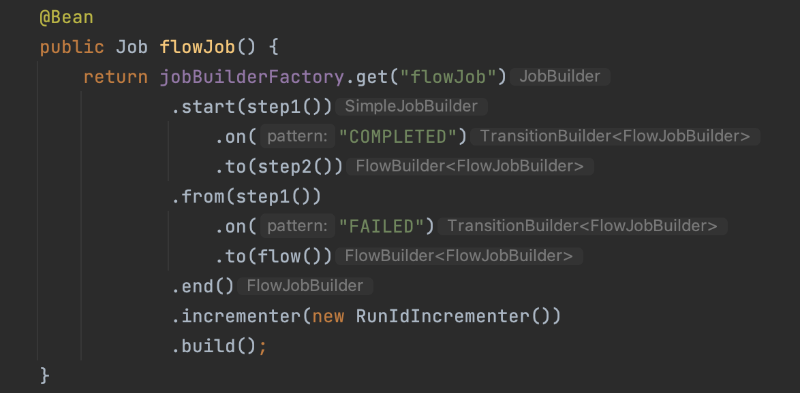

# flow

## FlowJob

Job 구현체 중 하나로 Step 또는 Flow가 조건에 의해 실행되도록 흐름을 구성한다.

### Job
* FlowJob 
* SimpleJob
* JsrJob

## Transition

Step의 실행 조건 및 흐름을 정의하는 도메인으로 TransitionBuilder를 통해 생성된다.



### API
* on(String pattern): Step의 ExitStatus(정확히는 exitCode) 패턴 지정
* to(): Step의 종료 상태가 on 메서드에 정의된 패턴에 해당할 때 다음으로 실행할 Step/Flow/Decider 지정
* from(): 이미 정의된 Step에 대해 흐름을 추가적으로 정의

SimpleJobBuilder
```java
public FlowBuilder.TransitionBuilder<FlowJobBuilder> on(String pattern) {
    Assert.state(this.steps.size() > 0, "You have to start a job with a step");
    Iterator var2 = this.steps.iterator();

    while(var2.hasNext()) {
        Step step = (Step)var2.next();
        if (this.builder == null) {
            this.builder = new JobFlowBuilder(new FlowJobBuilder(this), step);
        } else {
            this.builder.next(step);
        }
    }

    return this.builder.on(pattern);
}
```

FlowBuilder
```java
public TransitionBuilder<Q> on(String pattern) {
    return new TransitionBuilder(this, pattern);
}
```

FlowBuilder.TransitionBuilder
```java
public static class TransitionBuilder<Q> {
	private final FlowBuilder<Q> parent;
	private final String pattern;

	public FlowBuilder<Q> to(Step step) {
		State next = this.parent.createState(step);
		this.parent.addTransition(this.pattern, next);
		this.parent.currentState = next;
		return this.parent;
	}

	public FlowBuilder<Q> to(Flow flow) {
		State next = this.parent.createState(flow);
		this.parent.addTransition(this.pattern, next);
		this.parent.currentState = next;
		return this.parent;
	}

	public FlowBuilder<Q> to(JobExecutionDecider decider) {
		State next = this.parent.createState(decider);
		this.parent.addTransition(this.pattern, next);
		this.parent.currentState = next;
		return this.parent;
	}
}
```

addTransition 메서드 내부에서 StateTransition 객체 생성
```java
private void addTransition(String pattern, State next) {
    this.tos.put(next.getName(), next);
    this.transitions.add(StateTransition.createStateTransition(this.currentState, pattern, next.getName()));
    if (this.transitions.size() == 1) {
        this.transitions.add(StateTransition.createEndStateTransition(this.failedState));
        this.transitions.add(StateTransition.createEndStateTransition(this.completedState));
        this.transitions.add(StateTransition.createEndStateTransition(this.stoppedState));
    }

    if (next.isEndState()) {
        this.transitions.add(StateTransition.createEndStateTransition(next));
    }

    this.dirty = true;
}
```

Transition 처리 관련

* 하나의 Step에 대한 ExitStatus 패턴 조건이 여러번 정의되었을 때, 정의한 순서와 상관없이 더 구체적인 패턴일수록 우선 순위가 높게 반영된다.
* 만약 정의되지 않은 ExitStatus로 Step이 종료될 경우(COMPLETED로 종료될지라도) Job은 FAILED로 처리된다.
  * `FlowExecutionException`: Next state not found in flow=flowJob for state=flowJob.step0 with exit status=COMPLETED

### 사용자 정의 ExitStatus

Step이 종료된 뒤 커스텀한 exitCode를 가진 ExitStatus 객체를 새로 생성하여 Step의 종료 상태를 원하는 대로 변경할 수 있다. (StepExecutionListener afterStep() 메서드에서 지정)

```java
public class CustomStepExecutionListener implements StepExecutionListener {
	
	@Override
	public ExitStatus afterStep(StepExecution stepExecution) {
		return new ExitStatus("CUSTOM CODE");
	}
}
```

### JobExecutionDecider

Flow 정의를 위한 전용 클래스

커스텀한 ExitStatus를 설정하고 싶을 때 StepExecutionListener 대신 JobExecutionDecider를 사용하여 커스텀한 FlowExecutionStatus를 반환할 수 있다.

```java
@Configuration
@RequiredArgsConstructor
public class JobExecutionDeciderConfiguration {

	private final JobBuilderFactory jobBuilderFactory;
	private final StepBuilderFactory stepBuilderFactory;

	@Bean
	public Job flowJobByDecider() {
		return jobBuilderFactory.get("job")
				.start(flowJobByDeciderStep())
				.next(decider())
				.from(decider()).on("IGNORE").end()
				.from(decider()).on("ERROR").to(errorStep())
                .from(decider()).on("SUCCESS").to(successStep())
				.end()
				.build();
	}

	@Bean
	public JobExecutionDecider decider() {
		return (jobExecution, stepExecution) -> {
			if (...) {
				return new FlowExecutionStatus("IGNORE");
			} else if (...) {
				return new FlowExecutionStatus("ERROR");
			} else {
				return new FlowExecutionStatus("SUCCESS");
			}
		};
	}
}
```

## SimpleFlow

FlowJob 생성 시 FlowJob 내부에 저장되는 도메인으로 SimpleJob이 여러 개의 Step을 가지고 있는 것처럼 FlowJob은 하나의 SimpleFlow를 가지고 있고 하나의 SimpleFlow는 여러 개의 StateTransition으로 구성된다.

### StateTransition

```java
public final class StateTransition {
    private final State state; // 실행 대상 State
    private final String pattern; // 실행 조건인 종료코드 패턴
    private final String next; // 다음으로 실행될 State 이름
}
```

### State

FlowJob 생성 시 인자로 넘긴 Step, Flow, Decider 등을 통해 생성된다. handle() 메서드를 통해 멤버 필드로 가지고 있는 Step 또는 Flow를 실행하고 다음 플로우를 정하는데 필요한 상태값을 반환한다.

State
```java
public interface State {
    String getName();

    FlowExecutionStatus handle(FlowExecutor var1) throws Exception;

    boolean isEndState();
}
```

FlowBuilder를 통해 생성
```java
private State createState(Object input) {
    State result;
    if (input instanceof Step) {
        if (!this.states.containsKey(input)) {
            Step step = (Step)input;
            this.states.put(input, new StepState(this.prefix + "step" + this.stepCounter++, step));
        }

        result = (State)this.states.get(input);
    } else if (input instanceof JobExecutionDecider) {
        if (!this.states.containsKey(input)) {
            this.states.put(input, new DecisionState((JobExecutionDecider)input, this.prefix + "decision" + this.decisionCounter++));
        }

        result = (State)this.states.get(input);
    } else {
        if (!(input instanceof Flow)) {
            throw new FlowBuilderException("No state can be created for: " + input);
        }

        if (!this.states.containsKey(input)) {
            this.states.put(input, new FlowState((Flow)input, this.prefix + "flow" + this.flowCounter++));
        }

        result = (State)this.states.get(input);
    }

    this.dirty = true;
    return result;
}
```
