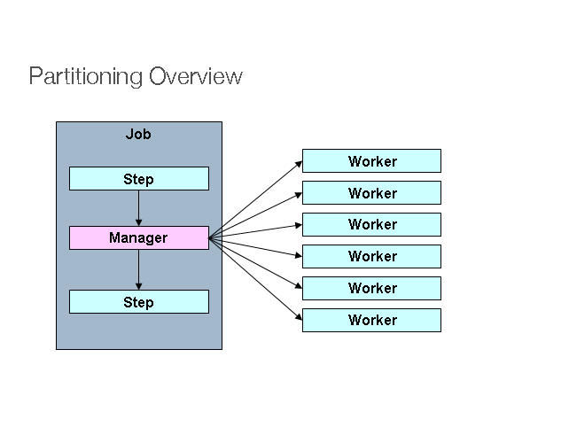
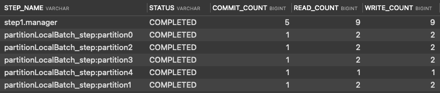

## 파티셔닝

파티셔닝은 매니저 (마스터) Step이 대량의 데이터 처리를 위해 지정된 수의 작업자 (Worker) Step으로 일감을 분할 처리하는 방식을 이야기한다.



예를 들어 파티셔닝 (Partitioning) Step에서 백만 개의 데이터를 더 작은 파티션으로 나누어 각 파티션을 Worker Step들이 병렬로 처리한다.


### 주요 인터페이스 
#### Partitioner
- Partitioner 인터페이스는 파티셔닝된 Step (Worker Step)을 위한 Step Executions을 생성하는 인터페이스 이다.
- Partitioner는 각 Worker Step들에게 어떤 Step Executions 변수를 가지게 할지를 결정하고, 그에 따라 생성할 Worker Step 수를 결정한다.

```java
public class SimplePartitioner implements Partitioner {

	private static final String PARTITION_KEY = "partition";

	@Override
	public Map<String, ExecutionContext> partition(int gridSize) {
		Map<String, ExecutionContext> map = new HashMap<>(gridSize);
		for (int i = 0; i < gridSize; i++) {
			map.put(PARTITION_KEY + i, new ExecutionContext());
		}
		return map;
	}

}
```
- 일반적으로는 StepExecution 당 1개의 Worker Step을 매핑하기 때문에 Worker Step의 수와 마찬가지로 보기도 한다.

#### PartitionHandler
- PartitionHandler 인터페이스는 매니저 (마스터) Step이 Worker Step를 어떻게 다룰지를 정의한다.
- 이를테면, 어느 Step을 Worker step의 코드로 두고 병렬로 실행하게 할지, 병렬로 실행한다면 쓰레드풀 관리는 어떻게 할지, gridSize는 몇으로 둘지 등등을 비롯하여 모든 작업이 완료되었는지를 식별하는지를 다룬다.

- TaskExecutorPartitionHandler
  - 단일 JVM 내에서 분할 개념을 사용할 수 있도록 같은 JVM 내에서 스레드로 분할 실행
- MessageChannelPartitionHandler
  - 원격의 JVM에 메타 데이터를 전송


#### 예제
- Partitioner 와 PartitionHandler 구현체를 사용해 파티션 스텝을 정의한다.
- 파티션 스텝 실행 이후 BATCH_STEP_EXECUTION 테이블에 각 파티션 스텝의 실행 정보가 저장된다.



## SynchronizedItemStreamReader
