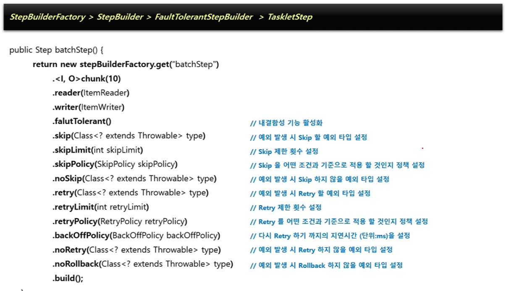

# 반복 및 오류 제어

---
- 스프링 배치가 제공하는 반복 및 오류 제어 기능을 학습한다.


## 1. Repeat

---

### 1-1. 반복 처리
#### RepeatOperations
- 배치 처리는 간단한 최적화에서든 job 일부로써든, 반복적인 처리를 수행한다.
- 반복처리를 전략화하고 일반화하기 위해, 스프링 배치는 프레임워크에 얼마나 반복해야 하는지 알려줄 수 있는 `RepeatOperations` 인터페이스를 제공한다.
```java
public interface RepeatOperations {
    RepeatStatus iterate(RepeatCallback callback) throws RepeatException;
}
```

- callback은 반복할 비지니스 로직을 넣을 수 있는 인터페이스이다.
```java
public interface RepeatCallback {
    RepeatStatus doInIteration(RepeatContext context) throws Exception;
}
```


#### RepeatTemplate
- `RepeatTemplate`은 `RepeatOperations`의 가장 간단한 구현체이다.
- 구현체가 반복을 종료할 때까지 콜백을 반복해서 호출한다.
- `RepeatStatus.CONTINUABLE`과 `RepeatStatus.FINISHED`를 포함하는 열거형(enumeration)을 리턴한다.
- `RepeatOperations` 구현체는 RepeatStatus를 검사해서 반복 여부를 결정한다.

```java
RepeatTemplate template = new RepeatTemplate();

template.setCompletionPolicy(new SimpleCompletionPolicy(2));

template.iterate(new RepeatCallback() {

    public RepeatStatus doInIteration(RepeatContext context) {
        // Do stuff in batch...
        return RepeatStatus.CONTINUABLE;
    }

});
```


#### RepeatContext
- RepeatCallback의 doInIteration 메소드에 전달되는 RepeatContext는 반복 처리의 상태를 저장하는데 사용된다.
- iterate 메소드가 호출될 때마다 새로운 RepeatContext가 생성된다.

### 1-2. 반복 종료 결정 요소

#### RepeatStatus
- `RepeatStatus`는 반복 처리의 상태를 나타내는 열거형이다.
- `RepeatStatus.CONTINUABLE`은 반복을 계속하고, `RepeatStatus.FINISHED`는 반복을 종료한다.

#### Completion Policies
- iterate 메소드는 CompletionPolicy를 사용해서 반복을 제어한다.
- 실행 횟수 또는 완료시기, 오류 발생 시 수행할 작업에 대한 반복여부 결정
- 여러 개를 등록 시 먼저 조건이 부합하는 CompletionPolicy 에 따라 반복문이 종료됨
- 종류
  - TimeoutTerminationPolicy
    - 반복 시점부터 현재 시점까지 소요된 시간이 설정된 시간보다 크면 반복종료(Default 타임아웃: 30초)
  - SimpleCompletionPolicy
    - 현재 반복 횟수가 ChunkSize 갯수보다 크면 반복종료(Default Chunk Size: 5)
  - CountingCompletionPolicy
    - 일정 카운트를 계산 및 집계해서 카운트 제한 조건이 만족하면 반복 종료

```java
public interface CompletionPolicy {

    /**
     * Determine whether a batch is complete given the latest result from the
     * callback. If this method returns true then
     */
    boolean isComplete(RepeatContext context, RepeatStatus result);

    /**
     * Allow policy to signal completion according to internal state, without
     * having to wait for the callback to complete.
     */
    boolean isComplete(RepeatContext context);
    
    RepeatContext start(RepeatContext parent);
    
    void update(RepeatContext context);
}
```

```java
SimpleCompletionPolicy policy = new SimpleCompletionPolicy(2);
```

#### Exception Handling
- `RepeatCallback` 안에서 예외가 발생하면 `RepeatTemplate`은 `ExceptionHandler`를 참고해서 예외를 다시 던질지 말지 결정한다.
- 종류
  - LogOrRethrowExceptionHandler
    - 예외를 로그로 기록할지 아니면 다시 던질지 결정
  - RethrowOnThresholdExceptionHandler
    - 지정된 유형의 예외가 임계값(Threshold)에 도달하면 다시 발생
  - SimpleLimitExceptionHandler
    - ExceptionHandler 인터페이스의 기본 구현체로, 지정된 유형의 예외 타입 중 하나가 발견되면 카운터가 증가하고, 제한에 도달하면 실패
```java
public interface ExceptionHandler {
    void handleException(RepeatContext context, Throwable throwable) throws Throwable;
}
```


### 1-3. 기타 반복 제어 기능
#### Listeners
- RedisTemplate에 RepeatListener를 등록해서 반복 처리의 시작과 종료 시점에 대한 이벤트를 처리할 수 있다.
- 리스너가 둘 이상이라면 리스트 안에 저장하므로 순서가 정해져 있다.
  이때는 open, before 메소드는 동일한 순서로 호출하는 반면 after, onError, close 메소드는 역순으로 호출한다.
```java
public interface RepeatListener {
    void before(RepeatContext context);
    void after(RepeatContext context, RepeatStatus result);
    void open(RepeatContext context);
    void onError(RepeatContext context, Throwable e);
    void close(RepeatContext context);
}
```
```java
RepeatTemplate template = new RepeatTemplate();
template.registerListener(new RepeatListener() {
    public void before(RepeatContext context) {
        // Do something before the batch...
    }
    public void after(RepeatContext context, RepeatStatus result) {
        // Do something after the batch...
    }
});
```

## 2. FaultTolerant

---
- Spring Batch는 Job 실행 중에 오류가 발생할 경우 장애를 처리하기 위한 기능을 제공하며 이를 통해 복원력을 향상시킬 수 있다.
- 오류가 발생해도 Step이 즉시 종료되지 않고 Retry 혹은 Skip 기능을 활성화 함으로써 내결함성 서비스가 가능하도록 한다.
- FaultTolerant 구조는 청크 기반의 프로세스 기반 위에 Skip과 Retry 기능이 추가되어 재정의 되어 있다.

